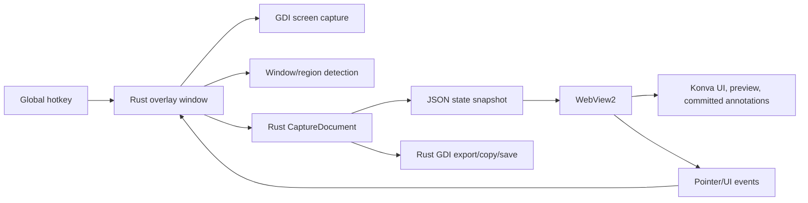

# Screen Captn Performance Optimization PRD

## Summary

Screen Captn is now a hybrid Rust + WebView2/Konva screenshot annotation app. The current user experience is visually strong, but the implementation still carries prototype-era performance costs: full canvas rebuilds, full state snapshots, duplicated render semantics, GDI fallback work, and expensive annotation operations that scale linearly.

This PRD defines a production performance pass with four goals:

- Maximum interaction speed.
- Lower memory usage.
- Faster rendering on 4K and multi-monitor setups.
- Cleaner execution with measurable, maintainable performance boundaries.

For this desktop app, "massive scale" means the app stays immediate under heavy local usage: large displays, many annotations, repeated sessions, large images/logos, long pen paths, mosaic regions, and frequent capture/export operations.

## Product Goals

1. Pointer-to-preview latency should feel instant for simple shapes, lines, arrows, pen, tag, mosaic, and text creation.
2. Toolbar and submenu interaction should remain visually identical while avoiding unnecessary redraws.
3. Memory should stay bounded during long capture sessions and repeated screenshot workflows.
4. Rust remains authoritative for app state, capture, hotkeys, tray, region detection, undo/history, clipboard, and save/export.
5. WebView/Konva remains authoritative for on-screen interactive rendering.
6. Export behavior remains correct while the app prepares for a future Web canvas export pipeline.

## Non-Goals

- No redesign of the current frontend experience.
- No feature behavior changes.
- No migration away from Rust in this phase.
- No React/Tauri/Electron rewrite.
- No removal of native fallback until parity and telemetry prove it is safe.

## Performance Targets

| Area | Target |
| --- | --- |
| Pointer move preview | 60 fps target, under 16 ms/frame for rectangle, oval, line, arrow |
| Pen drawing | Under 24 ms/frame on long strokes; no visible delayed trail |
| Toolbar hover/click | Under 50 ms perceived response |
| Theme toggle | Under 250 ms total animation, no stacked tweens |
| State sync after commit | Under 20 ms for normal sessions, under 60 ms for 200 annotations |
| Capture overlay open | Under 200 ms after hotkey on typical 4K display |
| Memory growth | No unbounded growth after 100 capture sessions |
| Undo history | Bounded by operation count and memory budget, not full document clones forever |

## Current Architecture



## Critical Bottlenecks

### 1. Full WebView Render Rebuilds

Current behavior in `crates/screencaptn-win/assets/web-ui/app.js` rebuilds layers aggressively:

- `uiLayer.destroyChildren()`
- `committedLayer.destroyChildren()`
- `previewLayer.destroyChildren()`
- rebuild toolbar, submenu, committed annotations, preview
- redraw all layers

This is simple and reliable, but expensive. It creates many short-lived Konva nodes, triggers garbage collection pressure, and makes minor state updates cost as much as large visual updates.

Impact:

- Slower interactions as annotation count grows.
- Higher memory churn.
- More frequent GC pauses.
- Toolbar hover and state changes can invalidate unrelated annotation rendering.

Target:

- Split rendering into invalidation domains: toolbar, submenu, committed annotations, preview, selection, watermark input.
- Rebuild only dirty layers.
- Reuse stable Konva nodes where practical.

### 2. Pointer Move JSON Traffic

The WebView sends `pointerMove` to Rust on every pointer movement. Rust then may sync state back, and WebView may redraw. For live previews, the browser already has the pointer and can render immediately.

Impact:

- Main-thread pressure on Rust and WebView.
- Serialization/deserialization on high-frequency input.
- Latency risk when Rust is busy with paint/export/capture work.

Target:

- WebView owns live preview during drag.
- Rust receives throttled/coalesced pointer updates only when needed for authoritative state.
- Rust receives final commit on mouse-up, then sends one authoritative annotation snapshot or diff.

### 3. Full Annotation Snapshot Sync

Rust currently sends full annotation state after many changes. The Web layer then destroys and redraws committed annotations.

Impact:

- O(n) serialization, parsing, object creation, and drawing for every small edit.
- Wasteful when only one annotation changes.
- Expensive for pen paths and large annotation lists.

Target:

- Introduce a render diff protocol:
  - `annotationAdded`
  - `annotationUpdated`
  - `annotationRemoved`
  - `selectionChanged`
  - `styleChanged`
  - `fullSnapshot` only on overlay open, undo/redo fallback, and recovery.

### 4. Duplicated Render Semantics

Rust and JS both know how to draw arrows, tags, highlighters, step badges, text, mosaic, selection handles, and watermark behavior. Some constants are already centralized via `RenderStyle`, but the duplication remains.

Impact:

- More maintenance risk.
- Visual mismatch after commits/export.
- Performance work must be done twice.

Target:

- Keep Rust as authoritative model/export.
- Make WebView the default on-screen renderer.
- Move all shared visual constants into one versioned render contract.
- Convert Rust native drawing to fallback/export-only paths.

### 5. GDI Full-Screen Back Buffer Work

The Rust overlay maintains full-screen compatible DCs and bitmaps. It uses BitBlt and invalidates large regions. A timer invalidates the region border every 80 ms while selection/hover is active.

Impact:

- Full-screen buffer work is expensive on 4K and multi-monitor.
- Region border animation can force more repaint work than needed.
- Native painting is still involved even when WebView owns on-screen annotation rendering.

Target:

- Limit invalidation rectangles where possible.
- Stop native animation timers when WebView is rendering the visual effect.
- Keep static background cache, but isolate animation and preview into WebView.

### 6. Mosaic Rendering Cost

The Web mosaic renderer creates many Konva rect nodes for every mosaic region. Large mosaic regions can create hundreds or thousands of nodes.

Impact:

- Heavy node count.
- Slow redraw and higher memory use.
- Potentially bad performance when the user resizes/moves mosaic annotations.

Target:

- Render mosaic as a single cached bitmap/canvas tile per annotation.
- Rebuild only when bounds, source background, or mosaic cell size changes.
- Use sampled background colors rather than static random grayscale when source pixels are available.

### 7. Pen Path Growth

Pen paths store many points. Both Rust and JS smooth points, clone vectors, flatten points, and redraw entire paths.

Impact:

- Long strokes become expensive.
- Undo history clones documents containing full point vectors.
- Selection and hit testing scan every segment.

Target:

- Coalesce points at input time with a velocity-aware threshold.
- Store simplified points plus raw points only when needed.
- Cache flattened/smoothed paths in the Web renderer.
- Use bounding boxes and spatial indexes before segment hit tests.

### 8. Undo History Full Clones

`History<T>` stores full cloned `CaptureDocument` snapshots. This is easy and correct, but memory-heavy as annotations grow.

Impact:

- Large pen paths and repeated edits multiply memory usage.
- Undo stack cost grows with full document size, not operation size.

Target:

- Replace full document snapshots with command-based history for high-volume operations.
- Keep occasional full checkpoints for recovery.
- Track memory budget for undo history.

### 9. O(n) Annotation Lookup and Hit Testing

Annotation lookup and selection use linear scans. This is acceptable for small sessions but scales poorly with many annotations or dense pen paths.

Impact:

- Selection can degrade as annotations grow.
- Pen paths are especially expensive because hit testing checks segments.

Target:

- Add an annotation index by ID.
- Add a spatial index or coarse grid for hit testing.
- Early reject by inflated bounds before precise path tests.

### 10. Startup and WebView Payload Size

The WebView host injects Konva and app JS into an HTML string through `NavigateToString`. This keeps packaging simple, but it creates a large string on startup.

Impact:

- Startup memory spike.
- Slow overlay creation on low-end machines.
- Harder to cache WebView content.

Target:

- Keep the bundled asset model for now.
- Cache the generated HTML string or move to a local virtual host mapping later.
- Create WebView once per app lifetime if overlay lifecycle allows it.

## Optimization Strategy

### Phase 1: Instrumentation First

Add lightweight performance telemetry before major rewrites.

Measurements:

- Overlay open time.
- WebView ready time.
- Pointer event rate.
- Preview render time.
- Committed layer render time.
- Rust state serialization time.
- JSON payload size.
- GDI paint time.
- Export time.
- Annotation count and total pen point count.
- Memory estimate for undo stack.

Production-ready code shape:

```rust
#[derive(Default)]
struct PerfCounters {
    overlay_open_ms: RollingMetric,
    paint_ms: RollingMetric,
    web_sync_ms: RollingMetric,
    web_payload_bytes: RollingMetric,
    annotation_count: usize,
    pen_point_count: usize,
}

struct PerfScope<'a> {
    metric: &'a mut RollingMetric,
    start: std::time::Instant,
}

impl<'a> Drop for PerfScope<'a> {
    fn drop(&mut self) {
        self.metric.record(self.start.elapsed());
    }
}
```

Acceptance:

- Debug build can log metrics to `%TEMP%\screencaptn-perf.log`.
- Release build keeps counters disabled or sampled.

### Phase 2: Dirty Layer Renderer

Replace global `render()` with explicit invalidation.

Target web renderer:

```js
const dirty = {
  toolbar: true,
  submenu: true,
  committed: true,
  preview: true,
  selection: true,
};

function scheduleRender(reason) {
  markDirty(reason);
  if (renderScheduled) return;
  renderScheduled = true;
  requestAnimationFrame(flushRender);
}

function flushRender() {
  renderScheduled = false;
  if (dirty.committed) renderCommittedDiffs();
  if (dirty.preview) renderPreviewFast();
  if (dirty.toolbar) renderToolbar();
  if (dirty.submenu) renderSubmenu();
  batchDrawDirtyLayers();
  clearDirty();
}
```

Rules:

- Pointer move only marks `preview`.
- Tool change marks `toolbar`, `submenu`, `preview`.
- Annotation commit marks `committed`, `selection`.
- Color/stroke/font change marks `submenu`, and selected annotation if edited.
- Theme change marks `toolbar`, `submenu`, and icons.

Acceptance:

- Rectangle/oval/line/arrow preview does not rebuild toolbar or committed annotations.
- Toolbar hover does not rebuild committed annotations.
- Editing one annotation does not rebuild all annotations.

### Phase 3: Render Diff Protocol

Introduce a versioned protocol between Rust and WebView.

Message examples:

```json
{
  "type": "annotationAdded",
  "revision": 42,
  "annotation": { "id": 12, "kind": { "type": "rectangle" } }
}
```

```json
{
  "type": "annotationUpdated",
  "revision": 43,
  "id": 12,
  "patch": {
    "bounds": { "x": 20, "y": 30, "width": 140, "height": 80 },
    "stroke": { "width": 4 }
  }
}
```

Rust shape:

```rust
#[derive(Serialize)]
#[serde(tag = "type", rename_all = "camelCase")]
enum WebRenderEvent<'a> {
    FullSnapshot {
        revision: u64,
        state: WebUiState<'a>,
    },
    AnnotationAdded {
        revision: u64,
        annotation: WebAnnotation<'a>,
    },
    AnnotationUpdated {
        revision: u64,
        id: AnnotationId,
        annotation: WebAnnotation<'a>,
    },
    AnnotationRemoved {
        revision: u64,
        id: AnnotationId,
    },
    SelectionChanged {
        revision: u64,
        selected_id: Option<AnnotationId>,
    },
}
```

Acceptance:

- Normal add/edit/delete sends one small event.
- Full snapshot is used only for overlay open, undo/redo recovery, and debug reset.

### Phase 4: Preview Node Reuse

Create stable preview nodes per tool instead of destroying/recreating on each pointer move.

Target JS shape:

```js
const previewNodes = new Map();

function getPreviewNode(kind, factory) {
  let node = previewNodes.get(kind);
  if (!node) {
    node = factory();
    previewLayer.add(node);
    previewNodes.set(kind, node);
  }
  node.visible(true);
  return node;
}

function hideUnusedPreviewNodes(activeKind) {
  for (const [kind, node] of previewNodes) {
    if (kind !== activeKind) node.visible(false);
  }
}
```

Acceptance:

- Simple shape previews mutate existing node geometry.
- Pen preview appends/coalesces points without rebuilding all UI.

### Phase 5: Annotation Render Cache

WebView should keep a node map keyed by annotation ID.

Target JS shape:

```js
const annotationNodes = new Map();

function upsertAnnotation(annotation) {
  let node = annotationNodes.get(annotation.id);
  if (!node || node.kind !== annotation.kind.type) {
    if (node) node.group.destroy();
    node = createAnnotationNode(annotation);
    annotationNodes.set(annotation.id, node);
    committedLayer.add(node.group);
  }
  updateAnnotationNode(node, annotation);
}

function removeAnnotation(id) {
  const node = annotationNodes.get(id);
  if (!node) return;
  node.group.destroy();
  annotationNodes.delete(id);
}
```

Acceptance:

- Updating a selected annotation mutates only that annotation node and selection node.
- Committed layer is not destroyed for every state message.

### Phase 6: Mosaic Bitmap Renderer

Replace per-cell Konva rects with one cached canvas/image per mosaic annotation.

Target:

- Build an offscreen canvas for each mosaic annotation.
- Sample the captured background under the mosaic region.
- Write larger mosaic blocks into the canvas.
- Render a single Konva.Image clipped to rounded bounds.

Acceptance:

- Large mosaic regions do not create large Konva node counts.
- Mosaic preview and committed mosaic share the same renderer.
- Moving a mosaic reuses cached image when underlying pixels are unchanged.

### Phase 7: History Memory Reduction

Move from full document clones to operation-based history.

Target Rust shape:

```rust
enum HistoryOp {
    Add { annotation: Annotation },
    Remove { annotation: Annotation },
    Update {
        id: AnnotationId,
        before: Annotation,
        after: Annotation,
    },
    RegionChange {
        before: Option<Rect>,
        after: Option<Rect>,
    },
}

struct History {
    undo: Vec<HistoryOp>,
    redo: Vec<HistoryOp>,
    memory_budget_bytes: usize,
}
```

Acceptance:

- Undo memory grows with edited objects, not the full document.
- Full snapshots are retained only as periodic recovery checkpoints.

### Phase 8: Spatial Hit Test Index

Add a coarse spatial index for annotations.

Target:

- Keep `Vec<Annotation>` for draw order.
- Add `HashMap<AnnotationId, usize>` for ID lookup.
- Add coarse grid or R-tree-like buckets for hit testing.
- Invalidate index only when annotation bounds change.

Acceptance:

- Hit testing checks only likely annotations.
- Pen paths are precise-tested only after bounds/bucket rejection.

## Cleaner Execution Model

### Event Ownership

| Event | Owner | Notes |
| --- | --- | --- |
| Toolbar hover/click | WebView | Sends command only on actual action |
| Pointer preview drag | WebView | Rust receives coalesced updates or final commit |
| Annotation commit | Rust | Rust creates authoritative annotation |
| Selection handles | WebView render, Rust state | WebView draws handles; Rust owns selected ID |
| Export/copy/save | Rust now, Web canvas later | Current behavior preserved |
| Window detection | Rust | No change |

### Render Ownership

| Surface | Owner | Optimization |
| --- | --- | --- |
| Region preview border | Rust or WebView, not both | Prefer WebView once parity is complete |
| Toolbar/options | WebView | Dirty UI layer only |
| Live preview | WebView | Reused nodes |
| Committed annotations | WebView | Node cache keyed by annotation ID |
| Export bitmap | Rust current | Later: Web canvas readback or shared renderer |

## Scalability Recommendations

1. Treat every pointer move as a high-frequency event. Never serialize full app state in response to raw pointer movement.
2. Keep WebView render objects stable. Mutate nodes; avoid destroy/recreate loops.
3. Keep Rust state authoritative, but send small diffs to the renderer.
4. Bound undo memory explicitly.
5. Add annotation indexing before annotation count becomes a UX issue.
6. Cache expensive visual output: icons, mosaic canvases, smoothed pen paths, text metrics, watermark bitmaps.
7. Use release-mode performance tests on real 4K and multi-monitor setups.
8. Keep one render contract so Rust export and WebView rendering do not drift.

## Production Readiness Checklist

- Performance telemetry exists and is easy to enable.
- No known unbounded timer-driven redraws.
- No full committed-layer rebuild on preview movement.
- No full state sync on pointer move.
- Mosaic uses cached bitmap/canvas rendering.
- Pen paths are coalesced and cached.
- History has a memory budget.
- WebView node count remains stable after repeated interactions.
- Native fallback can be disabled behind an internal flag once WebView parity is proven.
- Copy/save/export visuals are tracked against WebView on-screen visuals.

## Rollout Plan

### Milestone 1: Measure

- Add Rust and JS performance logging.
- Add debug overlay metrics behind a flag.
- Collect baseline numbers on 1080p, 4K, and multi-monitor.

### Milestone 2: Eliminate Full Rebuilds

- Add dirty-layer scheduler.
- Add preview node reuse.
- Keep full snapshot behavior intact as fallback.

### Milestone 3: Diff Sync

- Add revisioned Web render events.
- Add annotation node cache.
- Use full snapshot only for recovery and undo/redo initially.

### Milestone 4: Expensive Tool Optimization

- Replace mosaic rect-node rendering with cached canvas.
- Cache smoothed pen paths and text metrics.
- Add high-frequency input coalescing.

### Milestone 5: Memory Discipline

- Replace full-clone history with operation-based history.
- Add memory budget and telemetry.
- Add annotation ID map and hit-test index.

### Milestone 6: Export Alignment

- Decide whether to finish Rust export parity or move export to Web canvas readback.
- Keep existing Rust export until the replacement is proven.

## Risk Matrix

| Risk | Likelihood | Impact | Mitigation |
| --- | --- | --- | --- |
| Renderer diff bugs leave stale annotations | Medium | High | Keep full snapshot recovery path |
| WebView/Rust state divergence | Medium | High | Revision IDs and state checksum in debug builds |
| Mosaic canvas sampling increases complexity | Medium | Medium | Implement behind tool-specific renderer module |
| Operation history introduces undo bugs | Medium | High | Add tests per operation type |
| Export parity drift | High | Medium | Track with visual fixtures before changing export path |

## Recommended Next Step

Start with Milestone 1 and Milestone 2 together:

1. Add low-overhead timing counters.
2. Replace full `render()` rebuilds with dirty layer scheduling.
3. Reuse preview nodes for rectangle, oval, line, arrow, highlighter, and tag.

This attacks the lag users feel first while keeping app behavior intact. It also gives enough instrumentation to decide whether the heavier Rust-side refactors are justified by real data.
